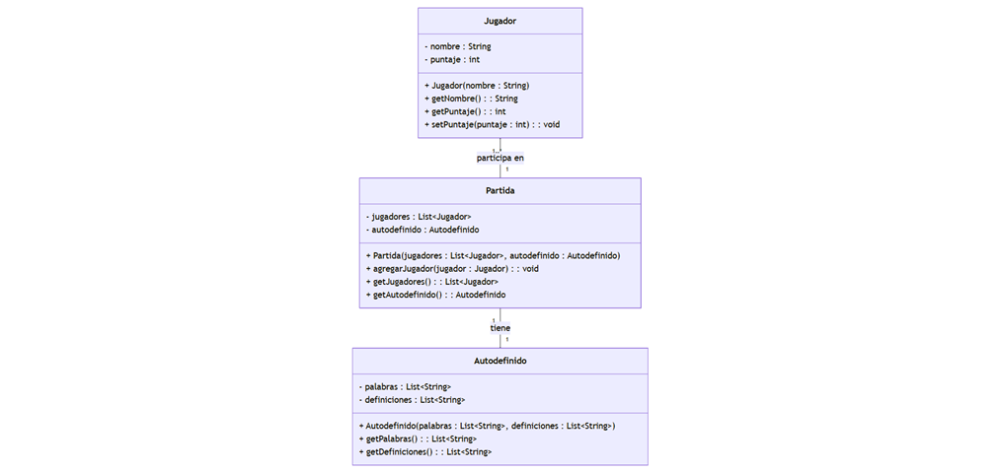
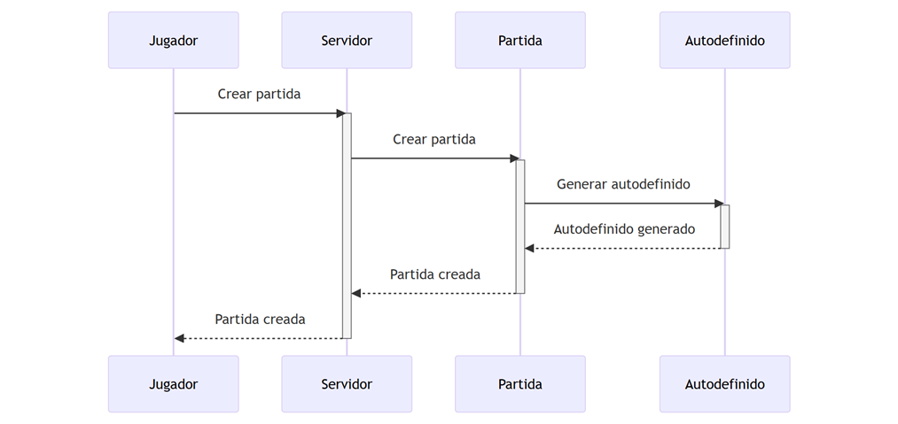
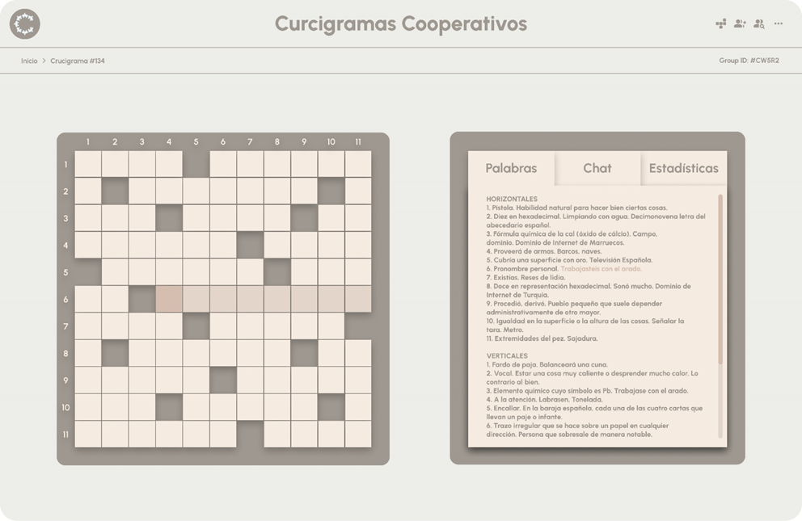

#  Crucigramas Cooperativos 

¡Hola a todos! Soy Isaac Rodríguez Cabezalí y este es mi proyecto escolar: ¡Crucigramas Cooperativos! 

## 📖 Explicación de la idea del proyecto 📖

Ultimamente las clases son muy aburridas asi que tantos mis compañeros como yo nos dedicamos a buscar cosas que hacer y formas de entretenernos. Los crucigramas siempre son una buena opción, pero no podemos jugarlos juntos. ¡Así fue como se me ocurrió crear una web de crucigramas cooperativos!

Los crucigramas no solo son divertidos, también nos ayudan a aprender palabras nuevas, a pensar de forma lógica y a trabajar en equipo.

## 🎯 Mis objetivos 🎯

* 🤝 **¡Diversión en equipo!**  Quiero que mi juego sea una forma genial de pasar tiempo con amigos y familiares, ayudándonos a resolver los crucigramas. Para lograr esto, creo salas privadas donde los jugadores pueden invitar a sus amigos y familiares. Además, la sincronización en tiempo real permite que todos vean los avances de los demás y puedan ayudarse mutuamente.

* 📱 **¡Accesible para todos!**  Utilizo tecnologías web como React.js y Node.js para crear una página que funcione en cualquier dispositivo con conexión a internet. Además, no es necesario registrarse ni descargar nada, lo que facilita mucho el acceso.

* 🩷 **¡Para todos los gustos!**  Quiero crear crucigramas de diferentes temas (cine, historia, deportes...) y con diferentes niveles de dificultad. ¡Así todos pueden jugar!

* 🏆 **¡Estadísticas para picarse!** Al final de cada partida, los jugadores podrán ver sus estadísticas y compararlas con las de los demás. ¡Esto les motivará a seguir jugando y mejorando!"

## 🌐 Tecnologías usadas 🌐

* **Frontend:**
    🧠 React.js: Es una librería de JavaScript muy potente que me permite crear interfaces de usuario interactivas y dinámicas. ¡Es perfecta para mi juego!
    ✨ TailwindCSS: Es un framework de CSS que me ayuda a diseñar la página web de forma rápida y sencilla. ¡Además, me permite crear un diseño moderno y atractivo!

* **Backend:**
    ⚙️ Node.js con Express: Es un entorno de ejecución de JavaScript que me permite crear servidores web de forma fácil y eficiente. ¡Se encarga de que todo funcione por detrás!
    ⏱️ Socket.IO: Es una librería que me permite crear conexiones en tiempo real entre el servidor y los clientes. ¡Gracias a ella, los jugadores pueden ver los cambios en el crucigrama al instante!

* **Alojamiento:**
    💻 Vercel: Es una plataforma que me permite desplegar mi página web de forma rápida y sencilla. ¡Así, mi juego está siempre disponible para todo el mundo!

## 📈 Diagramas 📈

### Diagrama de clases
Este diagrama muestra las diferentes clases que componen mi juego y cómo se relacionan entre sí:

### Diagrama de secuencia
Este diagrama muestra cómo interactúan los diferentes componentes del juego para que los jugadores puedan resolver el crucigrama juntos:

## 💻 Página web 💻

### 💭 Mockup 💭
Este es un diseño de como pretendo que se vea la web:

### 🎨 Paleta de colores 🎨

* EDEDE9: &nbsp;&nbsp;&nbsp;&nbsp;  #EDEDE9
* 9F9890: &nbsp;&nbsp;&nbsp;&nbsp;  #9F9890
* F5EBE0: &nbsp;&nbsp;&nbsp;&nbsp;  #F5EBE0
* E3D5CA: &nbsp;&nbsp;&nbsp;&nbsp;  #E3D5CA
* D5BDAF: &nbsp;&nbsp;&nbsp;&nbsp;  #D5BDAF

### ️👀 Logo ️👀
Este es el logo oficial del proyecto:

Es una letra C de Crucigramas y de Cooperativos formada por piezas de rompecabezas que simbolizan personas dandose la mano y trabajando en equipo.

### 🔗 Funcionalidades Web 🔗

* **¡Crea tu sala!**  El jugador que crea la sala recibe un código para invitar a sus amigos.
* **¡Elige tu tema!**  Los jugadores pueden elegir el tema del crucigrama (cine, historia, etc.).
* **¡Sincronización mágica!**  Todos los jugadores ven en tiempo real las letras que se escriben en el crucigrama.
* **¡Casillas destacadas!**  La casilla donde está escribiendo un jugador se destaca para evitar confusiones.
* **¡Estadísticas al final!**  Cada jugador puede ver sus estadísticas al final de la partida.

## ️🗺️ Roadmap en Linear 🗺️
Aquí puedes ver las tareas que tengo pendientes, que estoy realizando y las que ya he completado:

https://linear.app/crucigramas-cooperativos/join/5a082dc53c052fc059f552b910355bcf?s=3

## 🐈‍⬛ Repositorio en GitHub 🐈‍⬛
Este es el repositorio oficial con todo el codigo de mi proyecto:

https://github.com/Isroca23/Crucigramas-Cooperativos

## 👥¡Anímate a colaborar! 👥

Si te gusta mi proyecto y quieres ayudarme a mejorarlo, ¡no dudes en contactarme!

¡Espero que te guste mi juego!