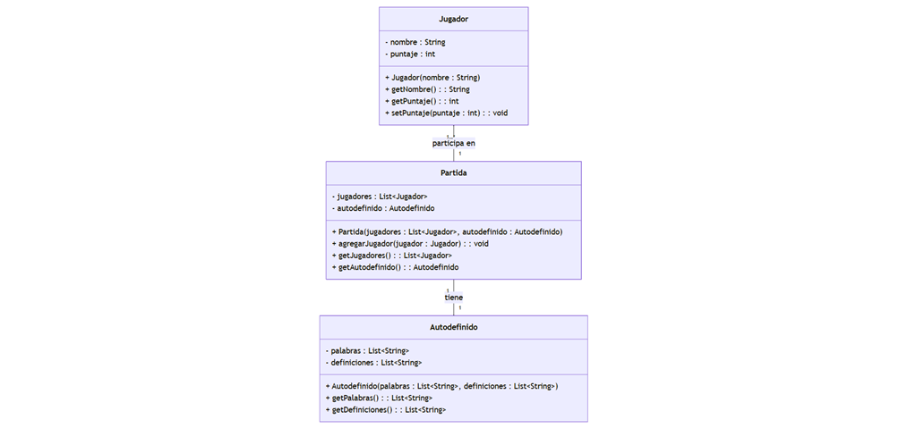
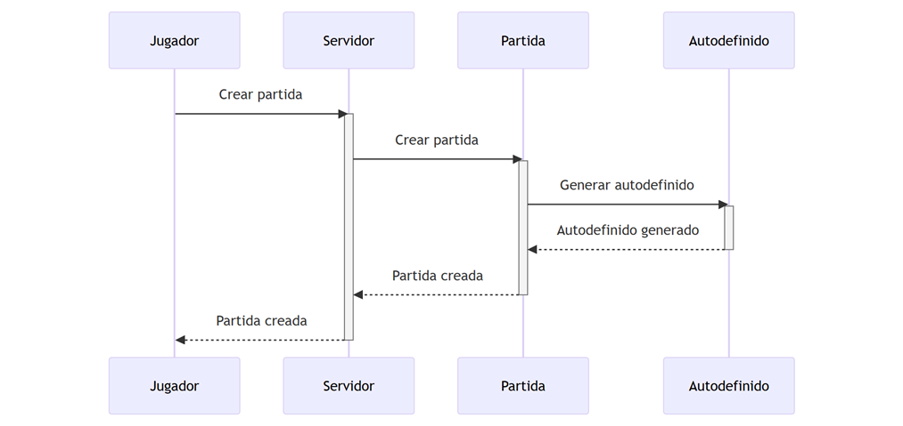
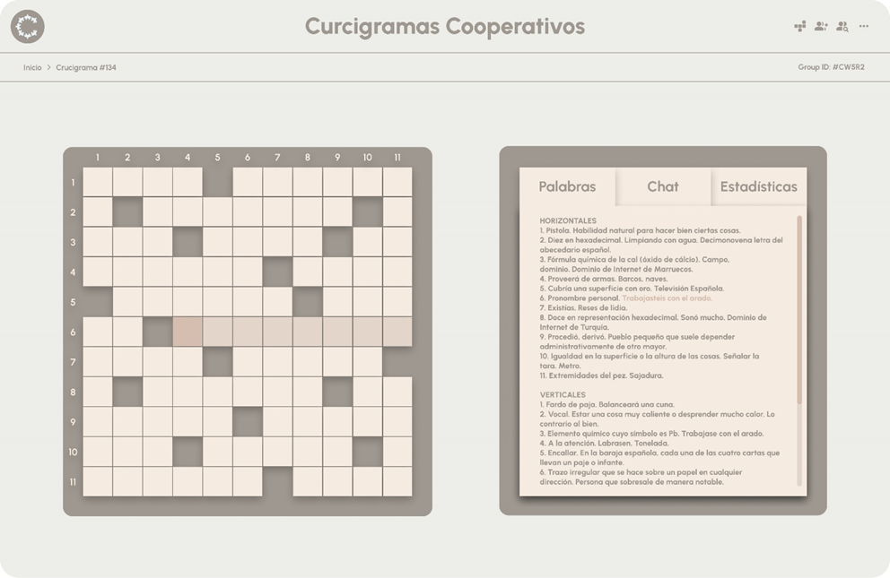
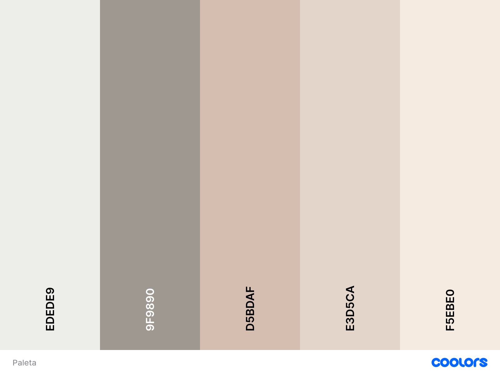

#  Crucigramas Cooperativos 

¡Hola a todos! Soy Isaac Rodríguez Cabezalí y este es mi proyecto escolar: ¡Crucigramas Cooperativos! 

## 📖 Sobre el Proyecto 📖

Crucigramas Cooperativos es una aplicación web que reinventa el concepto tradicional de los crucigramas transformándolos en una experiencia social y colaborativa. La aplicación permite a múltiples usuarios resolver crucigramas en tiempo real, fomentando el aprendizaje del lenguaje y el trabajo en equipo.

Los crucigramas no solo son divertidos, también nos ayudan a aprender palabras nuevas, a pensar de forma lógica y a trabajar en equipo.

## 🎯 Mis objetivos 🎯

* 🤝 **¡Diversión en equipo!**  Este juego es una forma genial de pasar tiempo con amigos y familiares, ayudándonos a resolver los crucigramas. Para lograr esto, creo salas privadas donde los jugadores pueden invitar a sus amigos y familiares. Además, la sincronización en tiempo real permite que todos vean los avances de los demás y puedan ayudarse mutuamente.

* 📱 **¡Accesible para todos!**  Utilizo tecnologías web como React.js y Node.js para crear una página que funcione en cualquier dispositivo con conexión a internet. Además, no es necesario registrarse ni descargar nada, lo que facilita mucho el acceso.

* 🩷 **¡Para todos los gustos!**  He implementando diferentes personalizaciones para la generación de crucigramas (cantidad de columnas y filas, palabras coloquiales y en desuso...)

* 🏆 **¡Estadísticas para picarse!** Al final de cada partida, los jugadores puede ver sus estadísticas y compararlas con las de los demás. ¡Esto motiva a seguir jugando y mejorando!"

## 🌐 Tecnologías usadas 🌐

* **Frontend:**
    🧠 React.js: Librería de JavaScript que proporciona una interfaz de usuario interactiva y dinámica.
    ✨ TailwindCSS: Framework de CSS que facilita un diseño moderno y responsive.

* **Backend:**
    ⚙️ Node.js con Express: Entorno de ejecución que gestiona la lógica del servidor de forma eficiente.
    ⏱️ Socket.IO: Sistema de comunicación en tiempo real entre servidor y clientes.

* **Despliegue:**
    💻 Vercel: Plataforma de hosting para el frontend.
    🌐 Render: Servicio de alojamiento especializado para el backend.

## 📈 Diagramas 📈

### Diagrama de clases
Este diagrama muestra las diferentes clases que componen mi juego y cómo se relacionan entre sí:



### Diagrama de secuencia
Este diagrama muestra cómo interactúan los diferentes componentes del juego para que los jugadores puedan resolver el crucigrama juntos:



## 💻 Página web 💻

### 💭 Mockup 💭
Este es un diseño de como pretendo que se vea la web:


### 🎨 Paleta de colores 🎨


### ️👀 Logo ️👀
Este es el logo oficial del proyecto:

Es una letra C de Crucigramas y de Cooperativos formada por piezas de rompecabezas que simbolizan personas dandose la mano y trabajando en equipo.

### 🔗 Funcionalidades Web 🔗

* **¡Crea tu sala!**  El jugador que crea la sala recibe un código para invitar a sus amigos.
* **¡A tu gusto!**  El anfitrión puede personalizar el crucigrama antes de generarlo.
* **¡Sincronización mágica!**  Todos los jugadores ven en tiempo real las letras que se escriben en el crucigrama.
* **¡Estadísticas al final!**  Cada jugador puede ver sus estadísticas al final de la partida.

## ️🗺️ Roadmap en Linear 🗺️
Aquí puedes ver las tareas que tengo pendientes, que estoy realizando y las que ya he completado:

https://linear.app/crucigramas-cooperativos/join/5a082dc53c052fc059f552b910355bcf?s=3

## 🐈‍⬛ Repositorio en GitHub 🐈‍⬛
Este es el repositorio oficial con todo el codigo de mi proyecto:

https://github.com/Isroca23/Crucigramas-Cooperativos

### 📁 Estructura del Proyecto 📁
```
crucigramas-cooperativos/
├── backend/                 
│   ├── api.js              # Gestión de API y lectura del diccionario
│   ├── crucigramas.js      # Lógica de generación de crucigramas
│   ├── diccionario.js      # Gestión del diccionario de palabras
│   ├── estadisticas.js     # Sistema de puntuación y estadísticas
│   ├── index.js            # Punto de entrada del servidor
│   ├── salas.js            # Gestión de salas y jugadores
│   ├── socketHandlers.js   # Manejadores de eventos Socket.IO
│   └── tablero.js          # Funciones del tablero de juego
│
├── frontend/               
│   ├── src/               
│   │   ├── componentes/   
│   │   │   ├── Definiciones.js    # Muestra definiciones de palabras
│   │   │   ├── Estadisticas.js    # Muestra puntuaciones
│   │   │   ├── Header.js          # Barra superior
│   │   │   ├── InitialScreen.js   # Pantalla inicial
│   │   │   ├── Modal.js           # Ventanas modales
│   │   │   ├── SubHeader.js       # Barra inferior del header
│   │   │   └── TabsContainer.js   # Contenedor de pestañas
│   │   │
│   │   ├── App.js        # Componente principal
│   │   ├── App.css       # Estilos principales
│   │   └── index.js      # Punto de entrada React
│   │
│   └── package.json      # Dependencias frontend
│
├── .gitignore           
├── LICENSE              # Licencia MIT
└── README.md           # Documentación
```

## 🔧 Instalación y Ejecución Local🔧

### 📋 Requisitos Previos 📋
* Node.js (v14 o superior)
* npm (v6 o superior)
* Git

### 1️⃣ Clonar el Repositorio 1️⃣
```bash
git clone https://github.com/Isroca23/Crucigramas-Cooperativos.git
cd Crucigramas-Cooperativo
```

### 2️⃣ Configurar el Backend 2️⃣
```bash
cd backend
npm install
node index.js
```

### 3️⃣ Configurar el Frontend 3️⃣
```bash
cd frontend
npm install
npm start
```

## 👥¡Anímate a colaborar! 👥

Si te gusta mi proyecto y quieres ayudarme a mejorarlo, ¡no dudes en contactarme!

¡Espero que te guste mi juego!

## 🤝 Contribución 🤝
1. Haz un Fork del proyecto
2. Crea tu rama de característica (`git checkout -b feature/AmazingFeature`)
3. Haz commit de tus cambios (`git commit -m 'Add some AmazingFeature'`)
4. Haz Push a la rama (`git push origin feature/AmazingFeature`)
5. Abre un Pull Request